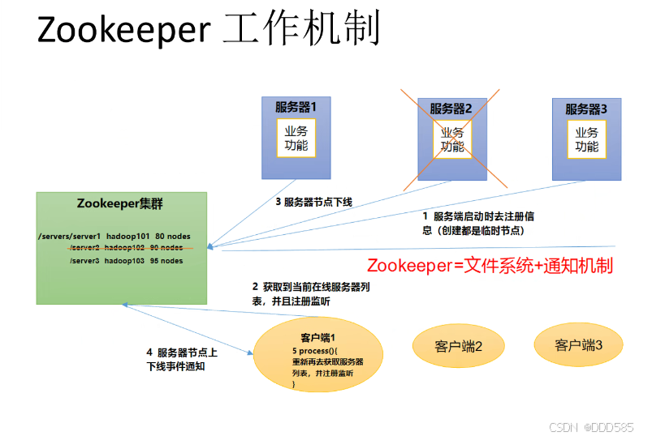
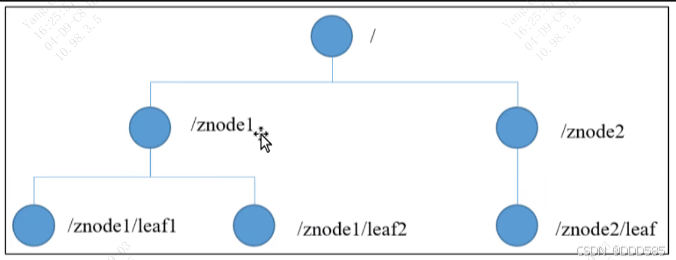

### ZooKeeper 架构

#### 1、ZooKeeper 工作机制

Zookeeper 从设计模式角度来理解：是一个基于观察者模式设计的分布式服务管理框架，它负责存储和管理大家都关心的数据，然后接收观察者的注册，一旦这些数据的状态发生变化，Zookeeper 就将负责已经在 Zookeeper 上注册的那些观察者，做出相应的反应。

也就是说 **Zookeeper = 文件系统 + 通知机制**。

#### 2、ZooKeeper 特点

* Zookeeper：一个领导者（Leader），多个跟随者（Follower）组成的集群。
* Zookeepe 集群中只要有半数以上节点存活，Zookeeper 集群就能正常服务。所以 Zookeeper 适合安装奇数台服务器。
* 全局数据一致：每个 Server 保存一份相同的数据副本，Client 无论连接到哪个 Server，数据都是一致的。
* 更新请求顺序执行，来自同一个 Client 的更新请求按其发送顺序依次执行，即先进先出。
* 数据更新原子性，一次数据更新要么成功，要么失败。
* 实时性，在一定时间范围内，Client 能读到最新数据。

#### 3、ZooKeeper 数据结构

ZooKeeper 数据模型的结构与 Linux 文件系统很类似，整体上可以看作是一棵树，每个节点称做一个 ZNode。每一个 ZNode 默认能够存储 1MB 的数据，每个 ZNode 都可以通过其路径唯一标识。

#### 4、ZooKeeper 选举机制

**4.1、第一次启动选举机制**

* 服务器1启动，发起一次选举。服务器1投自己一票。此时服务器1票数一票，不够半数以上（3票），选举无法完成，服务器1状态保持为 LOOKING；
* 服务器2启动，再发起一次选举。服务器1和2分别投自己一票并交换选票信息：此时服务器1发现服务器2的myid比自己目前投票推举的（服务器1）大，更改选票为推举服务器2。此时服务器1票数0票，服务器2票数2票，没有半数以上，选举无法完成，服务器1，2状态保持 LOOKING;
* 服务器3启动，发起一次选举。此时服务器1和2都会更改选票为服务器3。此次投票结果：服务器1为0票，服务器2为0票，服务器3为3票。此时服务器3的票数已经超过半数，服务器3当选Leader。服务器1，2更改状态为 FOLLOWING，服务器3更改状态为 LEADING；
* 服务器4启动，发起一次选举。此时服务器1，2，3已经不是 LOOKING 状态，不会更改选票信息。交换���票信息结果：服务器3为3票，服务器4为1票。此时服务器4服从多数，更改选票信息为服务器3，并更改状态为 FOLLOWING；
* 服务器5启动，同4一样当小弟。

**4.2、非第一次启动选举机制**

* 当 ZooKeepe 集群中的一台服务器出现以下两种情况之一时，就会开始进入 Leader 选举：
  * 服务器初始化启动。
  * 服务器运行期间无法和 Leader 保持连接。

* 而当一台机器进入 Leader 选举流程时，当前集群也可能会处于以下两种状态：

  * 集群中本来就已经存在一个Leader

    对于已经存在 Leader 的情况，机器试图去选举 Leader 时，会被告知当前服务器的 Leader 信息，对于该机器来说，仅仅需要和 Leader 机器建立连接，并进行状态同步即可。

  * 集群中确实不存在Leader

    假设 ZooKeeper 由5台服务器组成，SID 分别为1、2、3、4、5，ZXID 分别为118、119、120、120、119，并且此时 SID 为3的服务器是 Leader。某一时刻，3和5服务器出现故障，因此开始进行 Leader 选举。

**4.3、选举Leader规则：**

* EPOCH 大的直接胜出
* EPOCH 相同，事务id大的胜出
* 事务id相同，服务器id大的胜出

**4.4、关键概念解释：**

* **SID（服务器ID）：** 用来唯一标识一台 ZooKeeper 集群中的机器，每台机器不能重复，和 myid 一致。
* **ZXID（事务ID）：** ZXID 是一个事务 ID，用来标识一次服务器状态的变更。在某一时刻，集群中每台机器的 ZXID 值不一定完全一致，这和 ZooKeeper 服务器对于客户端"更新请求"的处理逻辑速度有关。
* **Epoch：** 每个 Leader 任期的代号；没有 Leader 时同一轮投票过程中的逻辑时钟值是相同的。每投完一次票，这个数据就会增加。
