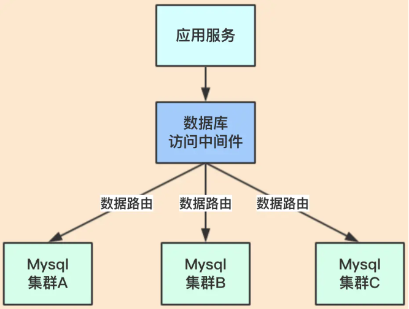
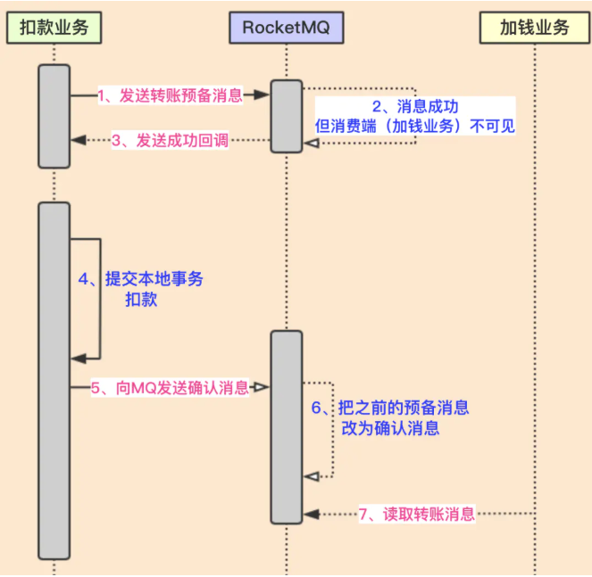
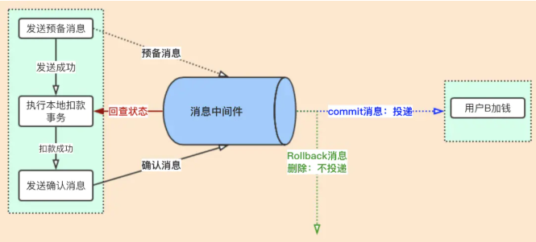

### RocketMQ 的分布式事务

在系统变的复杂后，分布式、微服务等架构技术，就要考虑到应用在系统中了。尤其数据量大了后，就需要对数据库进行拆分。一旦数据库进行了分拆，那就出现很多头疼的问题，其中之一就是事务问题。那我们就来看看问题是怎么出现的？

进行数据拆分后，就类似上面的架构。上图中我们就拿用户的数据进行举例，用户量一旦几千万时，就需要进行分库分表；上图就分了3个库，每个库都保证了高可用。这样的架构设计，会遇到事务问题，我们来看看具体的业务场景：用户A转账100元给用户B，这个业务比较简单，我们来分析一下里面具体的步骤：
* 用户A的账户先扣除100元
* 再把用户B的账户加100元

**问题？**
上述操作有两步，一个是操作用户A扣钱，一个是操作用户B加钱。如果在同一个数据库中进行，可以保证这两步操作，要么同时成功，要么同时不成功。这样就保证了转账的数据一致性。
但是如果用户A的数据在集群A中，用户B在集群B中呢？因为他们不在同一个事务中；如用户A扣款成功，但用户B加钱失败了，数据不完整了。
这种问题在微服务架构会更多，因为各个服务都是独立的模块，都是远程调用，都没法在同一个事务中，都会遇到事务问题。那怎么解决？网上有一些方案，如：两阶段提交，TCC等，还有常用就是最终一致性方案。加入消息中间件，看看如何优化。

**RocketMQ事务方案**

RocketMq消息中间件把消息分为两个阶段：Prepared阶段和确认阶段
* Prepared阶段（预备阶段）该阶段主要发一个消息到rocketmq，但该消息只储存在commitlog中，但消费者无法看到此消息。
* commit/rollback阶段（确认阶段）该阶段主要是把prepared消息保存到consumeQueue中，即让消费端可以消费此消息。

**整个正常流程：**
1. **在扣款之前，先发送预备消息(半消息)**
2. **发送预备消息成功后，执行本地扣款事务**
3. **扣款成功后，再发送确认消息（扣款失败，rollback消息，没有第4步）**
4. **消息端（加钱业务）可以看到确认消息，消费此消息，进行加钱**

**异常场景：**
1. 如果发送预备消息失败（图中第1点），下面的流程不会走下去；这个是正常的
2. 如果发送预备消息成功，但执行本地事务失败（图中第4点）；这个也没有问题，因为此预备消息不会被消费端订阅到，消费端不会执行业务。
3. 如果发送预备消息成功，执行本地事务成功，但发送确认消息失败（图中第5点）；这个就有问题了，因为用户A扣款成功了，但加钱业务没有订阅到确认消息，无法加钱。这里出现了数据不一致。

**状态回查**

RocketMq如何解决上面的问题，核心思路就是【状态回查】，也就是RocketMq会定时遍历commitlog中的预备消息。因为预备消息最终肯定会变为commit消息或Rollback消息，所以遍历预备消息去回查本地业务的执行状态，如果发现本地业务没有执行成功就rollBack，如果执行成功就发送commit消息。

* 异常场景2（图中第4点）：因为本地事务没有执行成功，RocketMQ回查业务，发现没有执行成功，就会发送RollBack确认消息，把消息进行删除。
* 异常场景3（图中第5点）：因为RocketMq会进行回查预备消息，在回查后发现业务已经扣款成功了，就补发“发送commit确认消息”；这样加钱业务就可以订阅此消息了。

在回查业务逻辑中，如何判断本地事务是否执行成功？
设计一张Transaction表，将业务表和Transaction绑定在同一个本地事务中，如果扣款本地事务成功时，Transaction中应当已经记录该TransactionId的状态为「已完成」。当RocketMq回查时，只需要检查对应的TransactionId的状态是否是「已完成」就好，而不用关心具体的业务数据。

**消费者端的幂等性消费**

实现幂等性消费的方式有很多种，具体怎么做，根据自己的情况来看。（幂等操作：其任意多次执行所产生的影响均与一次执行的影响相同）
1. 我们也可以额外创建一张表，来记录订单的处理情况。
2. 也可以将这些信息直接放到redis缓存里，在入库之前先查询缓存。
不管以哪种方式来做，总的思路就是在执行业务前，必须先查询该消息是否被处理过。
