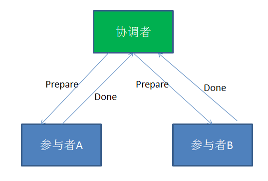
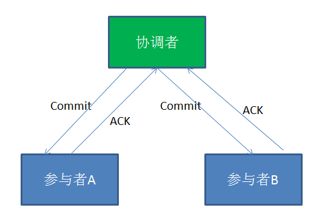
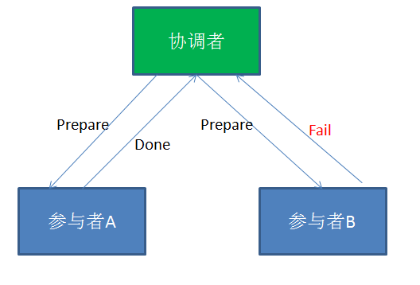
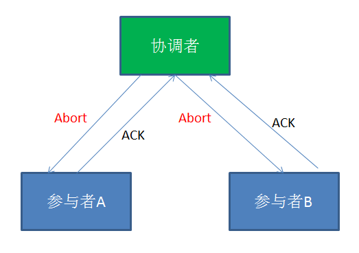

### 分布式事务

#### 1、什么是事务

事务就是作为单个逻辑单元执行的一组操作，要么全部成功，要么全部失败。
**事务的4个特性：**
* 原子性；整个事务中的所有操作，要么全部完成，要么全部不完成
* 一致性；一致性是指事务必须使数据库从一个一致性状态变换到另一个一致性状态，也就是说一个事务执行之前和执行之后都必须处于一致性状态。举例来说，假设用户A和用户B两者的钱加起来一共是1000，那么不管A和B之间如何转账、转几次账，事务结束后两个用户的钱相加起来应该还得是1000，这就是事务的一致性
* 隔离性；隔离性是当多个用户并发访问数据库时，比如同时操作同一张表时，数据库为每一个用户开启的事务，不能被其他事务的操作所干扰，多个并发事务之间要相互隔离
* 持久性；持久性是指一个事务一旦被提交了，那么对数据库中的数据的改变就是永久性的，即便是在数据库系统遇到故障的情况下也不会丢失提交事务的操作

**事务的隔离级别**

数据库事务的隔离级别有4个，由低到高依次为Read uncommitted(未授权读取、读未提交)、Read committed（授权读取、读提交）、Repeatable read（可重复读取）、Serializable（序列化），这四个级别可以逐个解决脏读、不可重复读、幻象读这几类问题。
* Read uncommitted(未授权读取、读未提交)：如果一个事务已经开始写数据，则另外一个事务则不允许同时进行写操作，但允许其他事务读此行数据。该隔离级别可以通过“排他写锁”实现。这样就避免了更新丢失，却可能出现脏读。也就是说事务B读取到了事务A未提交的数据。
* Read committed（授权读取、读提交）：读取数据的事务允许其他事务继续访问该行数据，但是未提交的写事务将会禁止其他事务访问该行。该隔离级别避免了脏读，但是却可能出现不可重复读。事务A事先读取了数据，事务B紧接了更新了数据，并提交了事务，而事务A再次读取该数据时，数据已经发生了改变。
* Repeatable read（可重复读取）：可重复读是指在一个事务内，多次读同一数据。在这个事务还没有结束时，另外一个事务也访问该同一数据。那么，在第一个事务中的两次读数据之间，即使第二个事务对数据进行修改，第一个事务两次读到的的数据是一样的。这样就发生了在一个事务内两次读到的数据是一样的，因此称为是可重复读。读取数据的事务将会禁止写事务（但允许读事务），写事务则禁止任何其他事务。这样避免了不可重复读取和脏读，但是有时可能出现幻象读。（读取数据的事务）这可以通过“共享读锁”和“排他写锁”实现。
* Serializable（序列化）：提供严格的事务隔离。它要求事务序列化执行，事务只能一个接着一个地执行，但不能并发执行（2个仅有查询的可以并发）。如果仅仅通过“行级锁”是无法实现事务序列化的，必须通过其他机制保证新插入的数据不会被刚执行查询操作的事务访问到。序列化是最高的事务隔离级别，同时代价也花费最高，性能很低，一般很少使用，在该级别下，事务顺序执行，不仅可以避免脏读、不可重复读，还避免了幻像读。

**InnoDB的四种事务的隔离级别，分别是怎么实现的？**
InnoDB使用不同的锁策略(Locking Strategy)来实现不同的隔离级别。
https://mp.weixin.qq.com/s/x_7E2R2i27Ci5O7kLQF0UA

**如何保证原子性？**

MySQL通过undo log来保证原子性；
比如，要修改A的值，那么在修改之前先读取A的原值，将A的原值写入undo log中，然后再修改A的值，再将undo log写入磁盘，然后将A的新值写入磁盘，事务提交；
如果在事务执行过程中意外宕机，那么就会读取undo log，将这个还没执行完的事务回滚；

**如何保证持久性？**

引入redo log，将修改的值记录到redo log中，先缓存在内存中，然后再将redo log顺序写入磁盘；
比如，要修改A，B的值，首先读取A的原值，写入undo log，然后修改A，将A的新值写入redo log中，然后读取B的原值，写入undo log中，然后修改B的值，将新值写入redo log中，然后将redo log顺序写入磁盘；
如果在事务在执行过程中宕机了，那么直接用undo log回滚；如果事务已经提交了，那么用redo log重做，保证了原子性和持久性；

**如何保证隔离性？**

MySQL有四个隔离级别，读未提交，读提交，可重复读，串行化；InnoDB默认级别是可重复读，通过MVCC实现；
隔离性保证了并发事务之间互不影响；

#### 2、分布式事务解决方案

**基于XA协议的两阶段提交**

XA是一个分布式事务协议，由Tuxedo提出。在XA协议中包含着两个角色：事务协调者和事务参与者。
**XA实现分布式事务的原理如下(成功的情况)：左图（第一阶段）、右图（第二阶段）**



* 在XA分布式事务的第一阶段，作为事务协调者的节点会首先向所有的参与者节点发送Prepare请求。在接到Prepare请求之后，每一个参与者节点会各自执行与事务有关的数据更新，写入Undo Log和Redo Log。如果参与者执行成功，暂时不提交事务，而是向事务协调节点返回“完成”消息。当事务协调者接到了所有参与者的返回消息，整个分布式事务将会进入第二阶段。
* 在XA分布式事务的第二阶段，如果事务协调节点在之前所收到都是正向返回，那么它将会向所有事务参与者发出Commit请求。接到Commit请求之后，事务参与者节点会各自进行本地的事务提交，并释放锁资源。当本地事务完成提交后，将会向事务协调者返回“完成”消息。当事务协调者接收到所有事务参与者的“完成”反馈，整个分布式事务完成。

**失败的情况：**
在XA的第一阶段，如果某个事务参与者反馈失败消息，说明该节点的本地事务执行不成功，必须回滚。于是在第二阶段，事务协调节点向所有的事务参与者发送Abort请求。接收到Abort请求之后，各个事务参与者节点需要在本地进行事务的回滚操作，回滚操作依照Undo Log来进行。



**XA两阶段提交的不足:**
* 性能问题;  XA协议遵循强一致性。在事务执行过程中，各个节点占用着数据库资源，只有当所有节点准备完毕，事务协调者才会通知提交，参与者提交后释放资源。这样的过程有着非常明显的性能问题。
* 协调者单点故障问题;  事务协调者是整个XA模型的核心，一旦事务协调者节点挂掉，参与者收不到提交或是回滚通知，参与者会一直处于中间状态无法完成事务。
* 丢失消息导致的不一致问题;  在XA协议的第二个阶段，如果发生局部网络问题，一部分事务参与者收到了提交消息，另一部分事务参与者没收到提交消息，那么就导致了节点之间数据的不一致。


如果避免XA两阶段提交的种种问题呢？有许多其他的分布式事务方案可供选择：
```mysql
1.XA三阶段提交
XA三阶段提交在两阶段提交的基础上增加了CanCommit阶段，并且引入了超时机制。一旦事物参与者迟迟没有接到协调者的commit请求，会自动进行本地commit。这样有效解决了协调者单点故障的问题。但是性能问题和不一致的问题仍然没有根本解决。
2.MQ事务
利用消息中间件来异步完成事务的后一半更新，实现系统的最终一致性。这个方式避免了像XA协议那样的性能问题。
3.TCC事务
TCC事务是Try、Commit、Cancel三种指令的缩写，其逻辑模式类似于XA两阶段提交，但是实现方式是在代码层面来人为实现。

```
